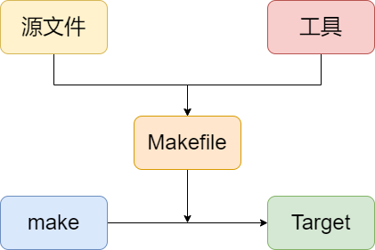

# 跟我一起写 Makefile 进阶版
&emsp;&emsp;最近，本人在移植 U-Boot 时，需要查看及修改 U-Boot 的 Makefile。由于之前对于 Makefile 可以说是一知半解，之前学的那点东西基本也消耗的差不多了，对于 U-Boot 源码中这种复杂的 Makefile 看起来是相当费力，于是在网上找到了《跟我一起写Makefile》这篇文章来系统的复习一下。

&emsp;&emsp;《跟我一起写Makefile》是前辈 [陈皓](https://coolshell.cn/haoel) 发表在其 [CSDN 博客](https://blog.csdn.net/haoel/article/details/2886) 上的系列文章。对于 Makefile 的讲解很透彻，并结合了一些示例。为了避免眼高手低，同时也为了后续查阅方便，现通过将其转载并整理到 Github 的方式来学习一下。

&emsp;&emsp;作者的原文中没有代码高亮，排版也不是很规则，文中的示例也没有提供代码，为了加深学习印象，我会提供完整的示例代码，并在原文中会添加了一些内容、图示等等。因此，本文与作者的原文稍有差异，但主体内容没有变化！我这里主要的更改有：
1. 增加示例代码（examples/*），用于验证文中的示例。我使用的环境是 Ubuntu 20.04.3，默认的 make 版本是 GNU Make 4.2.1 Built for x86_64-pc-linux-gnu。
2. 在文中增加一些图片辅助理解，同时对于原内容中的错误进行了更正。
3. Makefile 需要由 make 程序来解释执行。我个人认为，在讲解 Makefile 之前，有必要先告诉大家 make 程序的一些工作方式。了解了 make 的工作机制对于理解 Makefile 有一定的帮助。下图是一个 make 工作示意图：

    

    因此，我把作者的 make 的运行 章节的内容提到前面来，此外，对于原文中部分章节中关于 make 讲解的内容也提前到这个章节中。在 make 的运行 这一章节，我们不需要理解 Makefile 的内容，只需要关于 make 的工作机制即可。
4. 在作者原文后面，我又补充了一些作者没有讲出的内容，具体见目录中 `进阶` 章节中的各子章节内容。
5. 全文均为 Markdown 格式，方便大家查看及修改。在整理时部分内容稍微调整了文章的排版，以使其在 Markdown 下更美观。

&emsp;&emsp;在整理的时候，发现已经有网友做个这个工作了：https://github.com/seisman/how-to-write-makefile ，但是他这个使用的是 reStructuredText（扩展名 .rst）格式的文件，不是目前较为流行的 Markdown 格式（扩展名 .md）。而且这两种格式的语法差的也比较多，我这里再整理一个 Markdown 格式的！

# 相关内容
1. 前辈 [陈皓](https://coolshell.cn/haoel) 的 CSDN 博客地址：https://blog.csdn.net/haoel/article/details/2886 。本文中的内容版权归 [陈皓](https://coolshell.cn/haoel) 所有，作者要求转载注明作者及出处。

2. 项目主页： https://github.com/ZCShou/Makefile

3. 网页在线版： https://zcshou.github.io/Makefile/

4. 英文比较好的也可以直接去看这个官方手册：[GNU Make Manual](https://www.gnu.org/software/make/manual/)

# 关于本文档
1. 本文档系统使用开源文档网站生成器 **[docsify](https://docsify.js.org/#/)** 搭建，文档格式均为 Markdown 格式。
2. 文档中的绝大多数图示（部分截图除外）均使用开源软件 **[draw.io](https://www.diagrams.net/)** 绘制，并导出为 .PNG。所有图示的源码文件为 `./content/images/Makefile.drawio`（可使用 draw.io 打开即可）。
