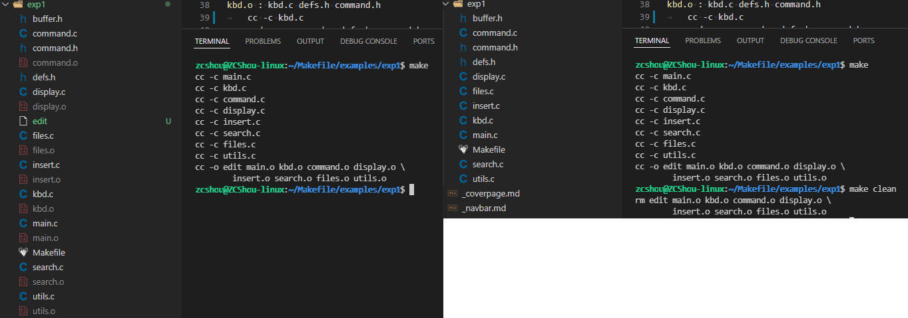

# Makefile 介绍
`make` 命令执行时，需要一个 Makefile 文件，以告诉 `make` 命令需要怎么样的去编译和链接程序。

&emsp;&emsp;首先，我们用一个示例来说明 Makefile 的书写规则，以便给大家一个感性认识。这个示例来源于 GNU 的 `make` 使用手册，在这个示例中，我们的工程有 8 个 c 文件，和 3 个头文件，我们要写一个 Makefile 来告诉 `make` 命令如何编译和链接这几个文件（完整 demo 见 examples/exp1）。我们的规则是：
1. 如果这个工程没有编译过，那么我们的所有 c 文件都要编译并被链接。
2. 如果这个工程的某几个 c 文件被修改，那么我们只编译被修改的 c 文件，并链接目标程序。
3. 如果这个工程的头文件被改变了，那么我们需要编译引用了这几个头文件的 c 文件，并链接目标程序。

&emsp;&emsp;只要我们的 Makefile 写得够好，所有的这一切，我们只用一个 `make` 命令就可以完成，`make`命令会自动智能地根据当前的文件修改的情况来确定哪些文件需要重编译，从而自动编译所需要的文件和链接目标程序。

## Makefile 规则
在讲述这个 Makefile 之前，还是让我们先来粗略地看一看 Makefile 的规则。
```makefile
target ... : prerequisites ...
	command
	...
	...
```
- **target**： 可以是一个 object file（目标文件），也可以是一个执行文件，还可以是一个标签（label）。对于标签这种特性，在后续的“伪目标”章节中会有叙述。
- **prerequisites**： 生成该 target 所依赖的文件和 / 或 target
- **command**： 该 target 要执行的命令（任意的 shell 命令）。

&emsp;&emsp;这是一个文件的依赖关系，也就是说，target 这一个或多个的目标文件依赖于 prerequisites 中的文件，其生成规则定义在 command 中。说白一点就是说：prerequisites 中如果有一个以上的文件比 target 文件要新的话，command 所定义的命令就会被执行。这就是 Makefile 的规则，也就是 Makefile 中最核心的内容。

&emsp;&emsp;说到底，Makefile 的东西就是这样一点，好像我的这篇文档也该结束了。呵呵。还不尽然，这是 Makefile 的主线和核心，但要写好一个 Makefile 还不够，我会在后面一点一点地结合我的工作经验给你慢慢道来。内容还多着呢。:)

## 一个示例
&emsp;&emsp;正如前面所说，如果一个工程有 3 个头文件和 8 个 c 文件（该示例源码见 `examples/exp1`），为了完成前面所述的那三个规则，我们的 Makefile 应该是下面的这个样子的。
```makefile
edit: main.o kbd.o command.o display.o \
		insert.o search.o files.o utils.o
	cc -o edit main.o kbd.o command.o display.o \
		insert.o search.o files.o utils.o

main.o: main.c defs.h
	cc -c main.c
kbd.o: kbd.c defs.h command.h
	cc -c kbd.c
command.o: command.c defs.h command.h
	cc -c command.c
display.o: display.c defs.h buffer.h
	cc -c display.c
insert.o: insert.c defs.h buffer.h
	cc -c insert.c
search.o: search.c defs.h buffer.h
	cc -c search.c
files.o: files.c defs.h buffer.h command.h
	cc -c files.c
utils.o: utils.c defs.h
	cc -c utils.c
clean:
	rm edit main.o kbd.o command.o display.o \
		insert.o search.o files.o utils.o
```
&emsp;&emsp;反斜杠（ `\` ）是换行符的意思。这样比较便于 Makefile 的阅读。我们可以把这个内容保存在名字为 “makefile” 或 “Makefile” 的文件中，然后在该目录下直接输入命令 `make` 就可以生成执行文件 edit。如果要删除执行文件和所有的中间目标文件，那么，只要简单地执行一下 `make clean` 就可以了。


&emsp;&emsp;在这个 Makefile 中，目标文件（target）包含：执行文件 edit 和中间目标文件（ `*.o` ），依赖文件（prerequisites）就是冒号后面的那些 `.c` 文件和 `.h` 文件。每一个 `.o` 文件都有一组依赖文件，而这些 `.o` 文件又是执行文件 `edit` 的依赖文件。依赖关系的实质就是说明了目标文件是由哪些文件生成的，换言之，目标文件是哪些文件更新的。

&emsp;&emsp;在定义好依赖关系后，后续的那一行定义了如何生成目标文件的操作系统命令，一定要以一个 `Tab` 键作为开头。记住，`make` 并不管命令是怎么工作的，他只管执行所定义的命令。`make` 会比较targets 文件和 prerequisites 文件的修改日期，如果 prerequisites 文件的日期要比 targets 文件的日期要新，或者 target 不存在的话，那么，`make` 就会执行后续定义的命令。

&emsp;&emsp;这里要说明一点的是， `clean` 不是一个文件，它只不过是一个动作名字，有点像 c 语言中的 label 一样，其冒号后什么也没有，那么，`make` 就不会自动去找它的依赖性，也就不会自动执行其后所定义的命令。要执行其后的命令，就要在 `make `命令后明显得指出这个 label 的名字。这样的方法非常有用，我们可以在一个 Makefile 中定义不用的编译或是和编译无关的命令，比如程序的打包，程序的备份，等等。

## make 是如何工作的
在默认的方式下，也就是我们只输入 `make` 命令。那么，
1. `make` 会在当前目录下找名字叫 “Makefile” 或 “makefile” 的文件。
2. 如果找到，它会找文件中的第一个目标文件（target），在上面的例子中，他会找到 “edit” 这个文件，并把这个文件作为最终的目标文件。
3. 如果 edit 文件不存在，或是 edit 所依赖的后面的 `.o` 文件的文件修改时间要比 `edit` 这个文件新，那么，他就会执行后面所定义的命令来生成 `edit` 这个文件。
4. 如果 `edit` 所依赖的 `.o` 文件也不存在，那么 `make` 会在当前文件中找目标为 `.o` 文件的依赖性，如果找到则再根据那一个规则生成 `.o` 文件。（这有点像一个堆栈的过程）
5. 当然，你的 C 文件和 H 文件是存在的啦，于是 `make` 会生成 `.o` 文件，然后再用 `.o` 文件生成 `make` 的终极任务，也就是执行文件 `edit` 了。

&emsp;&emsp;这就是整个 `make` 的依赖性，`make` 会一层又一层地去找文件的依赖关系，直到最终编译出第一个目标文件。在找寻的过程中，如果出现错误，比如最后被依赖的文件找不到，那么 `make` 就会直接退出，并报错，而对于所定义的命令的错误，或是编译不成功，`make` 根本不理。`make` 只管文件的依赖性，即，如果在我找了依赖关系之后，冒号后面的文件还是不在，那么对不起，我就不工作啦。

&emsp;&emsp;通过上述分析，我们知道，像 clean 这种，没有被第一个目标文件直接或间接关联，那么它后面所定义的命令将不会被自动执行，不过，我们可以显示要 `make` 执行。即命令——`make clean` ，以此来清除所有的目标文件，以便重编译。

&emsp;&emsp;于是在我们编程中，如果这个工程已被编译过了，当我们修改了其中一个源文件，比如 `file.c` ，那么根据我们的依赖性，我们的目标 `file.o` 会被重编译（也就是在这个依性关系后面所定义的命令），于是 `file.o` 的文件也是最新的啦，于是 `file.o` 的文件修改时间要比 `edit` 要新，所以 `edit` 也会被重新链接了（详见 `edit` 目标文件后定义的命令）。

而如果我们改变了 `command.h` ，那么， `kdb.o` 、 `command.o` 和 `files.o` 都会被重编译，并且， `edit` 会被重链接。

## Makefile 中使用变量
在上面的例子中，先让我们看看 edit 的规则：

```makefile
edit: main.o kbd.o command.o display.o \
		insert.o search.o files.o utils.o
	cc -o edit main.o kbd.o command.o display.o \
		insert.o search.o files.o utils.o
```
&emsp;&emsp;我们可以看到 `.o` 文件的字符串被重复了两次，如果我们的工程需要加入一个新的 `.o` 文件，那么我们需要在两个地方加（应该是三个地方，还有一个地方在 clean 中）。当然，我们的 Makefile 并不复杂，所以在两个地方加也不累，但如果 Makefile 变得复杂，那么我们就有可能会忘掉一个需要加入的地方，而导致编译失败。所以，为了 Makefile 的易维护，在 Makefile 中我们可以使用变量。Makefile 的变量也就是一个字符串，理解成 C 语言中的宏可能会更好。

&emsp;&emsp;比如，我们声明一个变量，叫 `objects`，`OBJECTS`，`objs`，`OBJS`，`obj` 或是 `OBJ`，反正不管什么啦，只要能够表示 obj 文件就行了。我们在 Makefile 一开始就这样定义：

```makefile
objects = main.o kbd.o command.o display.o \
    insert.o search.o files.o utils.o
```
于是，我们就可以很方便地在我们的 Makefile 中以 `$(objects)` 的方式来使用这个变量了，于是我们的改良版 Makefile 就变成下面这个样子：
```makefile
objects = main.o kbd.o command.o display.o \
	insert.o search.o files.o utils.o

edit: $(objects)
	cc -o edit $(objects)

main.o: main.c defs.h
	cc -c main.c
kbd.o: kbd.c defs.h command.h
	cc -c kbd.c
command.o: command.c defs.h command.h
	cc -c command.c
display.o: display.c defs.h buffer.h
	cc -c display.c
insert.o: insert.c defs.h buffer.h
	cc -c insert.c
search.o: search.c defs.h buffer.h
	cc -c search.c
files.o: files.c defs.h buffer.h command.h
	cc -c files.c
utils.o: utils.c defs.h
	cc -c utils.c
clean:
	rm edit $(objects)
```
于是如果有新的 `.o` 文件加入，我们只需简单地修改一下 `objects` 变量就可以了。

> 该示例可以通过在 example/exp1 中执行命令：`make -f Makefile.2` 来验证

关于变量更多的话题，我会在后续给你一一道来。

## 让 make 自动推导
&emsp;&emsp;GNU 的 `make` 很强大，它可以自动推导文件以及文件依赖关系后面的命令，于是我们就没必要去在每一个 `.o` 文件后都写上类似的命令，因为，我们的 `make` 会自动识别，并自己推导命令。

&emsp;&emsp;只要 make 看到一个 `.o` 文件，它就会自动的把 `.c` 文件加在依赖关系中，如果 make 找到一个 `whatever.o` ，那么 `whatever.c` 就会是 `whatever.o` 的依赖文件。并且 `cc -c whatever.c` 也会被推导出来，于是，我们的 Makefile 再也不用写得这么复杂。我们的新 Makefile 又出炉了。

```makefile
objects = main.o kbd.o command.o display.o \
	insert.o search.o files.o utils.o

edit: $(objects)
	cc -o edit $(objects)

main.o: defs.h
kbd.o: defs.h command.h
command.o: defs.h command.h
display.o: defs.h buffer.h
insert.o: defs.h buffer.h
search.o: defs.h buffer.h
files.o: defs.h buffer.h command.h
utils.o: defs.h

.PHONY : clean
clean :
	rm edit $(objects)
```
这种方法，也就是make的“隐晦规则”。上面文件内容中， ``.PHONY`` 表示 ``clean`` 是个伪目标文件。

> 该示例可以通过在 example/exp1 中执行命令：`make -f Makefile.3` 来验证

关于更为详细的 “隐晦规则” 和 “伪目标文件”，我会在后续给你一一道来。

## 另类风格的 Makefile
&emsp;&emsp;既然我们的 `make`可以自动推导命令，那么我看到那堆 `.o` 和 `.h` 的依赖就有点不爽，那么多的重复的 `.h` ，能不能把其收拢起来，好吧，没有问题，这个对于 `make` 来说很容易，谁叫它提供了自动推导命令和文件的功能呢？来看看最新风格的 Makefile 吧。

```makefile
objects = main.o kbd.o command.o display.o \
	insert.o search.o files.o utils.o

edit: $(objects)
	cc -o edit $(objects)

$(objects): defs.h
kbd.o command.o files.o: command.h
display.o insert.o search.o files.o: buffer.h

.PHONY: clean
clean:
	rm edit $(objects)
```
&emsp;&emsp;这种风格，让我们的 Makefile 变得很简单，但我们的文件依赖关系就显得有点凌乱了。鱼和熊掌不可兼得。还看你的喜好了。我是不喜欢这种风格的，一是文件的依赖关系看不清楚，二是如果文件一多，要加入几个新的 `.o` 文件，那就理不清楚了。

> 该示例可以通过在 example/exp1 中执行命令：`make -f Makefile.4` 来验证

## 清空目标文件的规则
&emsp;&emsp;每个 Makefile 中都应该写一个清空目标文件（ `.o` 和执行文件）的规则，这不仅便于重编译，也很利于保持文件的清洁。这是一个“修养”（呵呵，还记得我的《编程修养》吗）。一般的风格都是：
```makefile
clean:
	rm edit $(objects)
```
更为稳健的做法是：
```makefile
.PHONY : clean
clean :
	-rm edit $(objects)
```
&emsp;&emsp;前面说过， `.PHONY` 表示 `clean` 是一个“伪目标”。而在 `rm` 命令前面加了一个小减号的意思就是，也许某些文件出现问题，但不要管，继续做后面的事。当然， `clean` 的规则不要放在文件的开头，不然，这就会变成 `make` 的默认目标，相信谁也不愿意这样。不成文的规矩是 —— “clean 从来都是放在文件的最后”。

> 该示例可以通过在 example/exp1 中执行命令：`make clean -f Makefile.3` 或 `make clean -f Makefile.4` 来验证

上面就是一个 Makefile 的概貌，也是 Makefile 的基础，下面还有很多 Makefile 的相关细节，准备好了吗？准备好了就来。