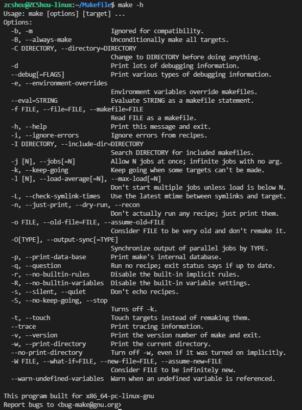

# make 的运行
&emsp;&emsp;一般来说，最简单的就是直接在命令行下输入 `make` 命令，`make` 命令会找当前目录的 Makefile 来执行，一切都是自动的。但也有时你也许只想让 `make` 重编译某些文件，而不是整个工程，而又有的时候你有几套编译规则，你想在不同的时候使用不同的编译规则，等等。本章节就是讲述如何使用 `make` 命令的。

> make 是一个解释 Makefile 中规则的命令行工具。

## make 的工作方式

GNU 的 make 工作时的执行步骤如下：（想来其它的 `make` 也是类似）
1. 读入所有的 Makefile。
2. 读入被 include 的其它 Makefile。
3. 初始化文件中的变量。
4. 推导隐晦规则，并分析所有规则。
5. 为所有的目标文件创建依赖关系链。
6. 根据依赖关系，决定哪些目标要重新生成。
7. 执行生成命令。

&emsp;&emsp;1-5 步为第一个阶段，6-7 为第二个阶段。第一个阶段中，如果定义的变量被使用了，那么，`make` 会把其展开在使用的位置。但 `make` 并不会完全马上展开，`make`使用的是拖延战术，如果变量出现在依赖关系的规则中，那么仅当这条依赖被决定要使用了，变量才会在其内部展开。

当然，这个工作方式你不一定要清楚，但是知道这个方式你也会对 `make` 更为熟悉。有了这个基础，后续部分也就容易看懂了。

## make 的退出码
`make` 命令执行后有三个退出码：
- **0**： 表示成功执行。
- **1**： 如果 `make` 运行时出现任何错误，其返回 1。
- **2**： 如果你使用了 `make` 的 “-q” 选项，并且 `make` 使得一些目标不需要更新，那么返回 2。

> 可以使用 `$?` 来获取该返回状态。Shell 中的 `$?` 可以获取函数返回值或者上一个命令的退出状态。具体如下：
> ```bash
> make
> echo $?
> ```

## make 的参数
&emsp;&emsp;下面列举了所有 GNU make 3.80 版的参数定义（注：新版本（我这里的 4.2.1）的参数也基本是这些）。其它版本和产商的 `make` 大同小异，不过其它产商的 `make` 的具体参数还是请参考各自的产品文档。


- `-b`, `-m`： 这两个参数的作用是忽略和其它版本 `make` 的兼容性。
- `-B`, `--always-make`： 认为所有的目标都需要更新（重编译）。
- `-C <dir>`, `--directory=<dir>`： 指定读取 Makefile 的目录。如果有多个 “-C” 参数，`make` 的解释是后面的路径以前面的作为相对路径，并以最后的目录作为被指定目录。如：`make -C ~hchen/test -C prog` 等价于 `make -C ~hchen/test/prog`。
- `-debug[=<options>]`： 输出 make 的调试信息。它有几种不同的级别可供选择，如果没有参数，那就是输出最简单的调试信息。下面是 `<options>` 的取值：
    - a: 也就是 all，输出所有的调试信息。（会非常的多）
    - b: 也就是 basic，只输出简单的调试信息。即输出不需要重编译的目标。
    - v: 也就是 verbose，在b选项的级别之上。输出的信息包括哪个 Makefile 被解析，不需要被重编译的依赖文件（或是依赖目标）等。
    - i: 也就是 implicit，输出所以的隐含规则。
    - j: 也就是 jobs，输出执行规则中命令的详细信息，如命令的 PID、返回码等。
    - m: 也就是 Makefile，输出 make 读取 Makefile，更新 Makefile，执行 Makefile 的信息。
- `-d`： 相当于 “--debug=a”。
- `-e`, `--environment-overrides`： 指明环境变量的值覆盖 Makefile 中定义的变量的值。
- `-f <file>`, `--file=<file>`, `--makefile=<file>`： 指定需要执行的 Makefile。
- `-h`, `--help`： 显示帮助信息。
- `-i` , `--ignore-errors`： 在执行时忽略所有的错误。
- `-I <dir>`, `--include-dir=<dir>`： 指定一个被包含 Makefile 的搜索目标。可以使用多个 “-I” 参数来指定多个目录。
- `-j [<jobsnum>]`, `--jobs[=<jobsnum>]`： 指同时运行命令的个数。如果没有这个参数，make 运行命令时能运行多少就运行多少。如果有一个以上的 “-j” 参数，那么仅最后一个 “-j” 才是有效的。（注意这个参数在 MS-DOS 中是无用的）
- `-k`, `--keep-going`： 出错也不停止运行。如果生成一个目标失败了，那么依赖于其上的目标就不会被执行了。
- `-l <load>`, `--load-average[=<load>]`, `-max-load[=<load>]`： 指定make运行命令的负载。
- `-n`, `--just-print`, `--dry-run`, `--recon`： 仅输出执行过程中的命令序列，但并不执行。
- `-o <file>`, `--old-file=<file>`, `--assume-old=<file>`： 不重新生成的指定的 `<file>`，即使这个目标的依赖文件新于它。
- `-p`, `--print-data-base`: 输出 Makefile 中的所有数据，包括所有的规则和变量。这个参数会让一个简单的 Makefile 都会输出一堆信息。如果你只是想输出信息而不想执行 Makefile，你可以使用 “make -qp” 命令。如果你想查看执行 Makefile 前的预设变量和规则，你可以使用 “make –p –f /dev/null”。这个参数输出的信息会包含着你的 Makefile 文件的文件名和行号，所以，用这个参数来调试你的 Makefile 会是很有用的，特别是当你的环境变量很复杂的时候。
- `-q`, `--question`: 不运行命令，也不输出。仅仅是检查所指定的目标是否需要更新。如果是 0 则说明要更新，如果是 2 则说明有错误发生。
- `-r`, `--no-builtin-rules`： 禁止 make 使用任何隐含规则。
- `-R`, `--no-builtin-variabes`： 禁止 make 使用任何作用于变量上的隐含规则。
- `-s`, `--silent`, `--quiet`： 在命令运行时不输出命令的输出。
- `-S`, `--no-keep-going`, `--stop`： 取消 “-k” 选项的作用。因为有些时候，make的选项是从环境变量 “MAKEFLAGS” 中继承下来的。所以你可以在命令行中使用这个参数来让环境变量中的 “-k” 选项失效。
- `-t`, `--touch`： 相当于 UNIX 的 touch 命令，只是把目标的修改日期变成最新的，也就是阻止生成目标的命令运行。
- `-v`, `--version`： 输出 make 程序的版本、版权等关于 make 的信息。
- `-w`, `--print-directory`： 输出运行 Makefile 之前和之后的信息。这个参数对于跟踪嵌套式调用 make 时很有用。
- `--no-print-directory`： 禁止 “-w” 选项。
- `-W <file>`, `--what-if=<file>`, `--new-file=<file>`, `--assume-file=<file>`： 假定目标 `<file>` 需要更新，如果和 “-n” 选项使用，那么这个参数会输出该目标更新时的运行动作。如果没有“-n”那么就像运行 UNIX 的 “touch” 命令一样，使得 `<file>` 的修改时间为当前时间。
- `--warn-undefined-variables`： 只要 make 发现有未定义的变量，那么就输出警告信息。

## 解析 Makefile
`make` 采用逐行解析的方式来解析整个 Makefile。解析步骤如下：
1. 读取完整的逻辑行，包括反斜杠转义的行
2. 移除注释
3. If the line begins with the recipe prefix character and we are in a rule context, add the line to the current recipe and read the next line.
4. Expand elements of the line which appear in an immediate expansion context.
5. 扫描该行，查找分隔符，例如':'或' = '，以确定该行是宏赋值还是规则。
6. Internalize the resulting operation and read the next line.

## 指定 Makefile
&emsp;&emsp;前面我们说过，GNU make 找寻默认的 Makefile 的规则是在当前目录下依次找三个文件 —— “GNUmakefile”、“makefile” 和 “Makefile”。其按顺序找这三个文件，一旦找到，就开始读取这个文件并执行。

&emsp;&emsp;当然，我们也可以给 `make` 命令指定一个特殊名字的 Makefile。要达到这个功能，我们要使用 `make` 的 `-f` 或是 `--file` 参数（ `--makefile` 参数也行）。例如，我们有个 Makefile 的名字是 “hchen.mk”，那么，我们可以这样来让 `make` 来执行这个文件：
```bash
make –f hchen.mk
```
如果在 `make` 的命令行中你不只一次地使用了 `-f` 参数，那么，所有指定的 Makefile 将会被连在一起传递给 `make` 执行。

## 指定目标
&emsp;&emsp;一般来说，`make` 的最终目标是 `Makefile`中的第一个目标，而其它目标一般是由这个目标连带出来的。这是 `make` 的默认行为。当然，一般来说，你的 Makefile 中的第一个目标是由许多个目标组成，你可以指示 `make`，让其完成你所指定的目标。要达到这一目的很简单，需在 `make` 命令后直接跟目标的名字就可以完成（如常用的 `make clean` 形式）

&emsp;&emsp;任何在 Makefile 中的目标都可以被指定成终极目标，但是除了以 `-` 打头或是包含了 `=` 的目标，因为有这些字符的目标，会被解析成命令行参数或是变量。甚至没有被我们明确写出来的目标也可以成为 `make` 的终极目标，也就是说，只要 `make` 可以找到其隐含规则推导规则，那么这个隐含目标同样可以被指定成终极目标。

&emsp;&emsp;有一个 `make` 的环境变量叫 `MAKECMDGOALS` ，这个变量中会存放你所指定的终极目标的列表，如果在命令行上，你没有指定目标，那么，这个变量是空值。这个变量可以让你使用在一些比较特殊的情形下。比如下面的例子：
```makefile
sources = foo.c bar.c
ifneq ( $(MAKECMDGOALS),clean)
    include $(sources:.c=.d)
endif
```
基于上面的这个例子，只要我们输入的命令不是 “make clean”，那么 Makefile 会自动包含 “foo.d” 和 “bar.d” 这两个 Makefile。

使用指定终极目标的方法可以很方便地让我们编译我们的程序，例如下面这个例子：
```makefile
.PHONY: all
all: prog1 prog2 prog3 prog4
```
&emsp;&emsp;从这个例子中，我们可以看到，这个 Makefile 中有四个需要编译的程序 —— “prog1”， “prog2”，“prog3”和  “prog4”，我们可以使用 “make all” 命令来编译所有的目标（如果把 all 置成第一个目标，那么只需执行 “make”），我们也可以使用 “make prog2” 来单独编译目标 “prog2”。

&emsp;&emsp;即然 `make` 可以指定所有 Makefile 中的目标，那么也包括 “伪目标”，于是我们可以根据这种性质来让我们的 Makefile 根据指定的不同的目标来完成不同的事。

## 环境变量 MAKEFILES
&emsp;&emsp;如果你的当前环境中定义了环境变量 `MAKEFILES` ，那么，`make` 会把这个变量中的值做一个类似于 `include` 的动作。这个变量中的值是其它的 Makefile，用空格分隔。只是，它和 `include` 不同的是，从这个环境变量中引入的 Makefile 的“目标”不会起作用，如果环境变量中定义的文件发现错误，`make` 也会不理。

&emsp;&emsp;但是在这里我还是建议不要使用这个环境变量，因为只要这个变量一被定义，那么当你使用 `make` 时，所有的 Makefile 都会受到它的影响，这绝不是你想看到的。在这里提这个事，只是为了告诉大家，也许有时候你的 Makefile 出现了怪事，那么你可以看看当前环境中有没有定义这个变量。

## 检查规则
有时候，我们不想让我们的 Makefile 中的规则执行起来，我们只想检查一下我们的命令，或是执行的序列。于是我们可以使用 `make` 命令的下述参数：
- `-n`, `--just-print`, `--dry-run`, `--recon`： 不执行参数，这些参数只是打印命令，不管目标是否更新，把规则和连带规则下的命令打印出来，但不执行，这些参数对于我们调试 Makefile 很有用处。
- `-t`, `--touch`： 这个参数的意思就是把目标文件的时间更新，但不更改目标文件。也就是说，`make` 假装编译目标，但不是真正的编译目标，只是把目标变成已编译过的状态。
- `-q`, `--question`: 这个参数的行为是找目标的意思，也就是说，如果目标存在，那么其什么也不会输出，当然也不会执行编译，如果目标不存在，其会打印出一条出错信息。
- `-W <file>`, `--what-if=<file>`, `--assume-new=<file>`, `--new-file=<file>`： 这个参数需要指定一个文件。一般是是源文件（或依赖文件），`make` 会根据规则推导来运行依赖于这个文件的命令，一般来说，可以和 “-n” 参数一同使用，来查看这个依赖文件所发生的规则命令。

另外一个很有意思的用法是结合 `-p` 和 `-v` 来输出 Makefile 被执行时的信息（这个将在后面讲述）。

