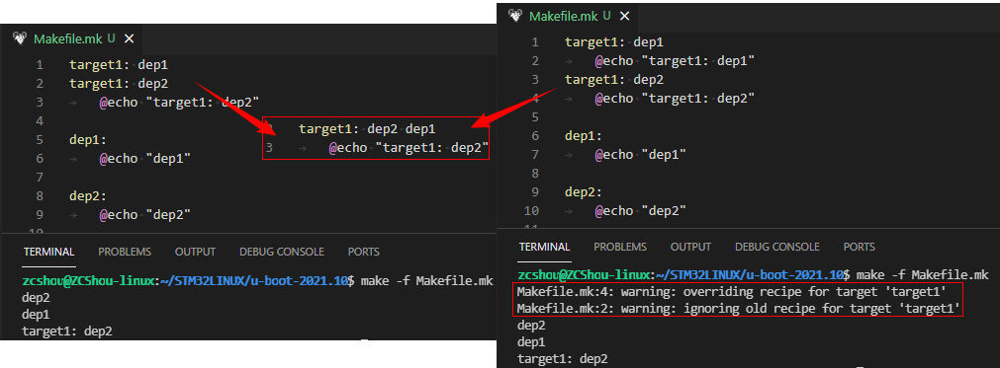

# 规则匹配机制
在前的文章中，我们说过 Makefile 中有很多规则，规则也会有各种依赖规则。make 程序对于规则的匹配并不是完全匹配，而是使用近似匹配方式。

如果给出了目标，则 make 优先去找匹配的规则（匹配规则：完整匹配 > 通配符半匹配 > 完全通配符匹配）去执行；如果没有给出参数，make 会自动找到 Makefile 中第一个目标中没有通配符的规则执行。

如果 Makefile 中存在多条同名规则，则 make 程序会尝试将他们合并。但是如果这些同名规则都有命令的话，make 会给出警告，并用后面的命令代替前面的命令。如下图所示：

该图中的示例代码见 `examples/exp100/*`。