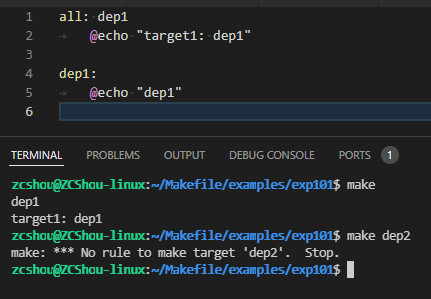
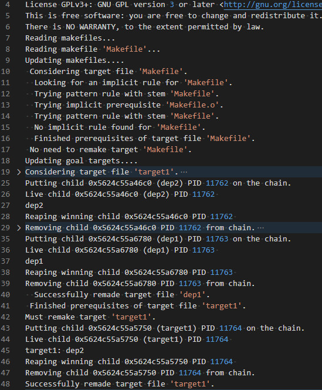
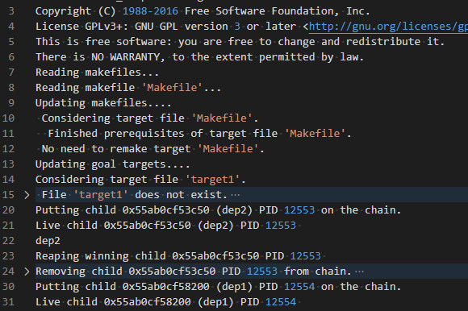
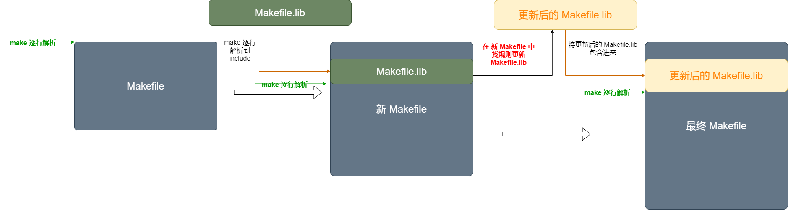

# 规则处理机制
&emsp;&emsp;在前面的文章中，我们介绍过 Makefile 中有很多规则，规则也会有各种依赖规则，这里就涉及到了 `make` 如何处理这些规则的问题。

## 规则匹配机制
**make 程序对于规则（包括规则的依赖）的匹配并不是完全匹配，而是使用近似匹配方式。**
1. 如果我们在执行 `make` 命令时给出了目标（例如 `make clean`），则 `make` 优先去找匹配的规则（ ***匹配规则：完整匹配 > 通配符半匹配 > 完全通配符匹配*** ），然后去解析匹配到的规则，如果匹配不到规则会报错然后停止。
2. 如果在执行 `make` 命令时没有给出目标，则 `make` 会自动找到 Makefile 中第一个目标中没有通配符的规则执行。

下图是示例 examples/exp101 的执行结果

## 同名规则
&emsp;&emsp;Makefile 中允许定义同名规则。如果 Makefile 中存在多条同名规则，则 `make` 程序会尝试将他们合并。但是如果这些同名规则都有命令的话，`make` 会给出警告，并用后面的命令代替前面的命令。如下图所示：

该图中的示例代码见 `examples/exp100`。

## 更新 Makefile 自身
&emsp;&emsp;在默认情况下，`make` 总是会优先把 Makefile 本身作为目标，并尝试使用各种隐式规则去重建 Makefile 本身。如下图所示的是 `examples/exp100` 下使用命令 `make --debug=all` 的执行记录（省略部分内容）：

如上图中，make 读取了 Makefile 文件之后，随即开始将 Makefile 作为目标，尝试重建 Makefile。关于这部分内容可以在官方手册的 [How Makefiles Are Remade](https://www.gnu.org/software/make/manual/make.html#Remaking-Makefiles) 章节找到详细的说明。如果你不想让 `make` 自动构件 Makefile 本身，则可以在自己的 Makefile 中增加一条规则：`Makefile: ;` 命令依赖都是空的。添加后执行的结果如下：

## include 其他 Makefile
由于以上默认处理的原因，这就使得在 Makefile 中包含其他 Makefile 时变得有些麻烦，需要我们特殊注意。

&emsp;&emsp;Makefile 中的 include 命令与 C 语言中的 `#include` 命令类似，例如，命令 `include Makefile.lib`，即把 Makefile.lib 文件在当前 Makefile 文件中展开，也就是把 Makefile.lib 文件的内容包含进了当前 Makefile 文件 `include Makefile.lib` 所在的位置。如果 Makefile 中存在以 Makefile.lib 为目标的规则，则 `make` 会先使用规则对 Makefile.lib 文件进行更新，然后将更新后的 Makefile.lib 文件包含进当前 Makefile 文件。

- 当包含的目标文件不存在时，以文件名为查找规则，并开始匹配隐式规则，尝试生成
- 当包含的目标文件不存在且查找到的规则中创建了目标文件时，则将创建成功的目标文件包含进当前 Makefile
- 当包含的目标文件存在时，则将目标文件包含进当前 Makefile，然后以目标文件名查找是否有相应规则。如果找到了规则：比较规则的依赖关系，决定是否执行规则命令；如果没有规则：无操作。
- 当包含的目标文件存在存在且目标名对应的规则被执行规则中的命令更新了目标文件时，make 重新包含目标文件，替换之前包含的内容目标文件未被更新

更详细的内容参考网友博文 https://www.cnblogs.com/cuckoos/articles/5049984.html 和 https://www.jianshu.com/p/a512424793dc

## 命令执行机制
&emsp;&emsp;如果目标中给出了多行命令，那么每一行命令将在一个独立的子 shell 进程中被执行。就是说，每一行命令的执行是在一个独立的 shell 进城中完成。因此多行命令之间的执行是相互独立的多个进程，相互之间不存在依赖。当 `make` 在执行命令时，如果某一条命令执行失败（被一个信号中止，或非零退出），且该条命令产生的错误未被忽略，那么其它的用于重建同一目标的命令执行也将会被终止，`make` 进程以错误告终。

> 这里就和 `make` 的  `-jxx` 参数有关系。该参数指出同时运行命令的个数。我们需要注意的是，如果没有这个参数，`make` 运行命令时能运行多少就运行多少，而不是固定一个个执行。

&emsp;&emsp;`make` 并不是对每个子 `make -C` 的返回值做检测，而是对整个子 sh 的返回值做检测。确切的说应该是 `make` 调用了子进程 sh，然后 sh 又调用了子进程 `make` 运行 `make -C`，即make –> sh –> make 的关系，所以 `make` 只能看到 sh 的返回值，而 sh 中最后一条语句的返回值会作为 sh 的返回值。
